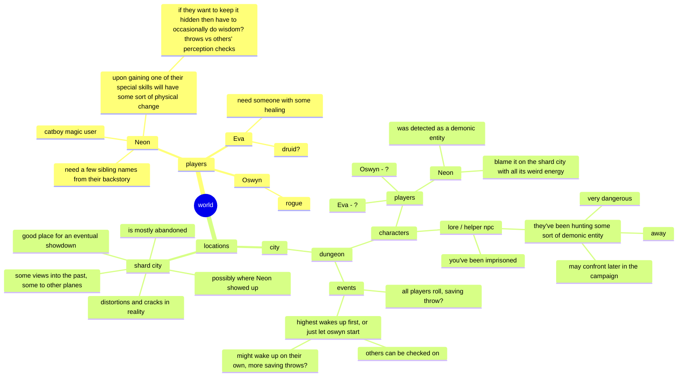

```mermaid
mindmap
  ((world))
    players
      Oswyn
        rogue
      Neon
        catboy magic user
        need a few sibling names from their backstory
        upon gaining one of their special skills will have some sort of physical change
          if they want to keep it hidden then have to occasionally do wisdom? throws vs others' perception checks
      Eva
        druid?
        need someone with some healing
    locations
      city
        dungeon
          characters
            players
              Oswyn - ?
              Neon
                was detected as a demonic entity
                blame it on the shard city with all its weird energy
              Eva - ?
            lore / helper npc
              you've been imprisoned
              they've been hunting some sort of demonic entity
                very dangerous
                away
                may confront later in the campaign
          events
            all players roll, saving throw?
            highest wakes up first, or just let oswyn start
              others can be checked on
              might wake up on their own, more saving throws?
      shard city
        distortions and cracks in reality
        is mostly abandoned
        some views into the past, some to other planes
        possibly where Neon showed up
        good place for an eventual showdown
```
